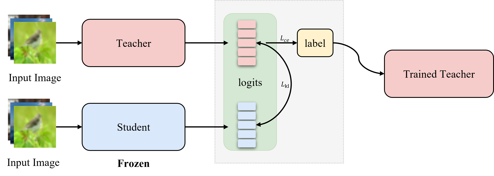

# README

# **Trained Teacher: who is good at teaching**

Xingzhu Liang, Feilong Bi, Wen Liu, Xinyun Yan, Chunjiong Zhang, Chenxing Xia

## Overview



This project introduces a novel approach to knowledge distillation, a method used to train small and efficient neural networks by transferring knowledge from a complex teacher model to a simpler student model. Our approach involves using a specially trained teacher network, which incorporates knowledge distillation constraints during its own training and adapts to the teaching model in advance, thereby minimizing the gap between the student and teacher models.

We refer to this approach as "Trained Teacher," and our results show that it outperforms traditional knowledge distillation methods by 2% in terms of accuracy on standard KD across multiple datasets. Additionally, our educated teachers can be used with existing mainstream knowledge distillation methods, making our approach easy to implement.

Overall, our approach offers a promising way to improve knowledge distillation and help researchers and practitioners develop more efficient and accurate neural networks.

## Prerequisite

We use Pytorch 1.4.0, and CUDA 10.1. You can install them with
`conda install pytorch=1.4.0 torchvision=0.5.0 cudatoolkit=10.1 -c pytorch`
It should also be applicable to other Pytorch and CUDA versions.

Then install other packages by `pip install -r requirements.txt`

## Usage

### Teacher networks

### Step 1: Train a normal teacher network

```
python train_scratch.py --save_path [XXX]

```

Here, [XXX] specifies the directory of `params.json`, which contains all hyperparameters to train a network. We already include all hyperparameters in `experiments` to reproduce the results in our paper.

For example, normally train a ResNet18 on CIFAR-10
`python train_scratch.py –save_path experiments/CIFAR10/baseline/resnet18`

After finishing training, you will get `training.log`, `best_model.tar` in that directory.

The normal student network will serve as the **adversarial network** for the training of the trained teacher.

### Step 2: Train a nasty teacher network

```
python train_trained_teacher.py --save_path [XXX]

```

Again, [XXX] specifies the directory of `params.json`, which contains the information of adversarial networks and hyperparameters for training.
You need to specify the architecture of adversarial network and its checkpoint in this file.

For example, train a trained ResNet18
`python train_trained_teacher.py –save_path experiments/CIFAR10/kd_trained_resnet18/trained_resnet18`

### Knowledge Distillation for Student networks

You can train a student distilling from normal or nasty teachers by `python train_kd.py –save_path [XXX]`
Again, [XXX] specifies the directory of `params.json`, which contains the information of student networks and teacher networks

For example,

- train a plain CNN distilling from a trained ResNet18 `python train_kd.py –save_path experiments/CIFAR10/kd_trained_resnet18/cnn`
- Train a plain CNN distilling from a normal ResNet18

```
python train_kd.py --save_path experiments/CIFAR10/kd_normal_resnet18/cnn

```

## Acknowledgement

- [Nasty-Teacher](https://github.com/VITA-Group/Nasty-Teacher/)
- [Teacher-free KD](https://github.com/yuanli2333/Teacher-free-Knowledge-Distillation)
- [DAFL](https://github.com/huawei-noah/Data-Efficient-Model-Compression/tree/master/DAFL)
- [DeepInversion](https://github.com/NVlabs/DeepInversion)